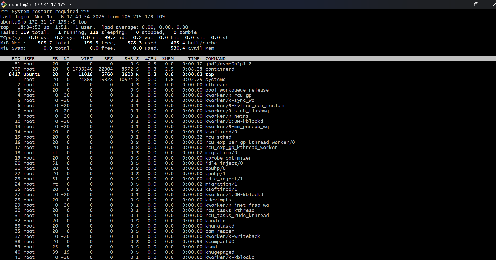
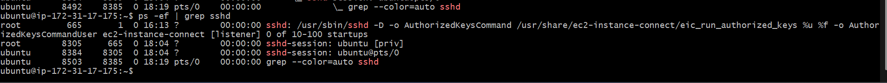
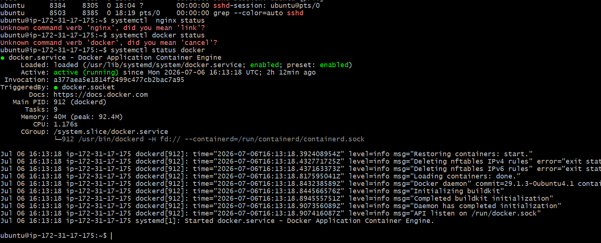
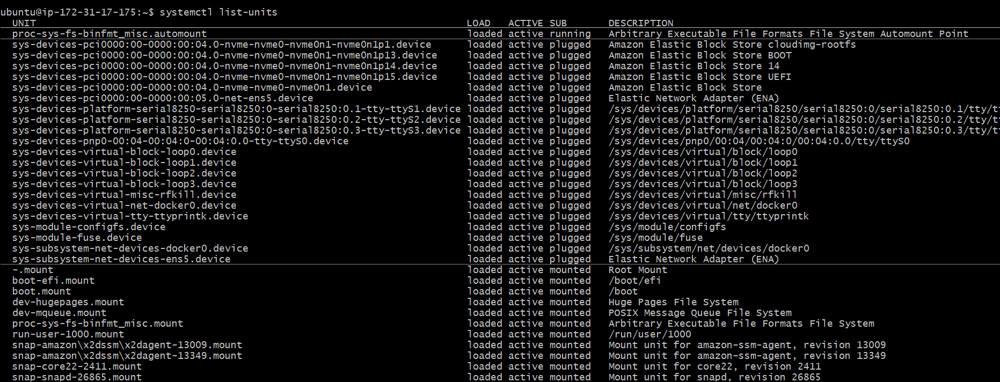
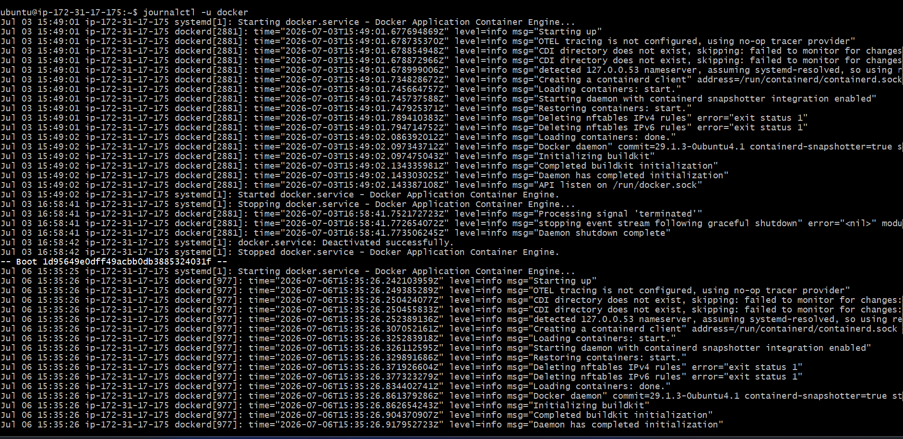
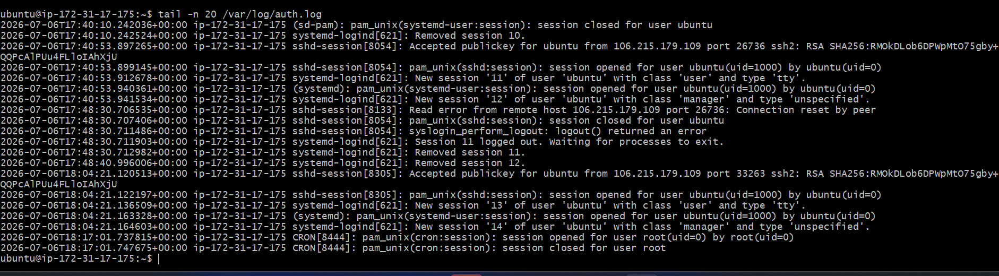

# Day 04 – Linux Practice: Processes and Services

This document captures hands-on Linux practice focused on processes, services, and logs using the SSH service on an Ubuntu AWS EC2 instance.

Environment:

OS: Ubuntu (AWS EC2)
Authentication: SSH key-based authentication
Service inspected: SSH (sshd)

## Process Command

1. **top** - The `top` command is a real-time system monitoring tool in Linux. It continuously displays information about running processes and overall system resource usage.

## Output

2. **ps -ef | grep sshd** -

is used to find and display all running SSH daemon (sshd) processes on a Linux system. It lists every running process and filters the output to show only those related to the SSH service.

## Output

## service commands ##
1. **systemctl status docker**

It will show the docker service are running or not
## Output
 

2. **systemctl list-units**
What it does
Lists all active and loaded systemd units.
Shows their current state (running, waiting, exited, etc.).
Helps you monitor system services and other systemd-managed resources.
## Output
 

##  Log Commands ##
1. **journalctl -u docker**

What does it do?
Displays all log messages generated by the specified service.
Helps you diagnose why a service started, stopped, failed, or produced errors.
 

1. **tail -n 20 /var/log/auth.log**
Explanation:
Displays the most recent authentication and authorization activity on the system.

Observations from output:

SSH session opened for user ubuntu
sudo command activity logged
cron jobs running as root
Clear audit trail for security monitoring

 ## Key Learnings ##
AWS EC2 uses key-based SSH authentication
systemctl is used to inspect and manage services
Logs (journalctl, auth.log) are essential for troubleshooting and security auditing

