# Linux Troubleshooting Runbook

## Target Service: docker (Docker Engine Daemon)
**1. Environment Basics**.

**uname -a**

- The uname command displays system information about your Linux machine.

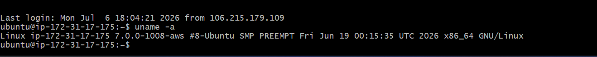 

**cat /etc/os-release**

- This command displays detailed information about the Linux distribution (Operating System)  installed on your machine

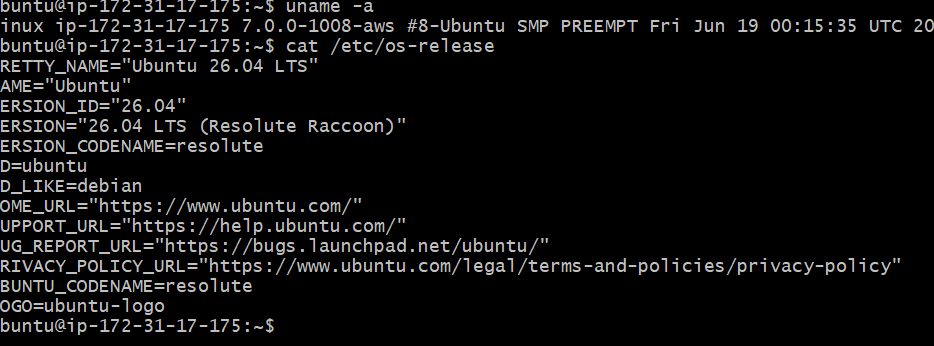 

## 2. Filesystem Sanity Check##

**mkdir /tmp/runbook-demo**

**cp /etc/hosts /tmp/runbook-demo/hosts-copy && ls -l /tmp/runbook-demo**

The command:
- cp /etc/hosts /tmp/runbook-demo/hosts-copy && ls -l /tmp/runbook-demo

does two operations. The && means the second command runs only if the first command succeeds.

Step 1:
- cp /etc/hosts /tmp/runbook-demo/hosts-copy
- cp = Copy command.
- /etc/hosts = Source file (a system file that maps hostnames to IP addresses).
- /tmp/runbook-demo/hosts-copy = Destination path and new filename.

What it does:

- Copies the /etc/hosts file into the /tmp/runbook-demo directory.
- Renames the copied file to hosts-copy.

For example:

Source:
/etc/hosts

Destination:
/tmp/runbook-demo/hosts-copy

Step 2:
ls -l /tmp/runbook-demo
ls = List files and directories.
-l = Long listing format (shows detailed information).

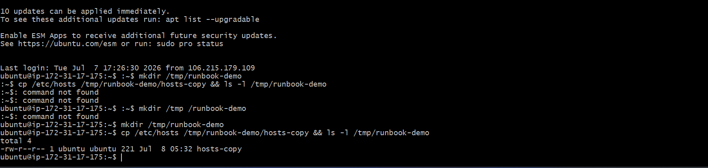 

## 3. Snapshot: CPU & Memory ##

 **pgrep dockerd**

 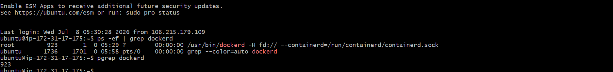 

 **free -h**

 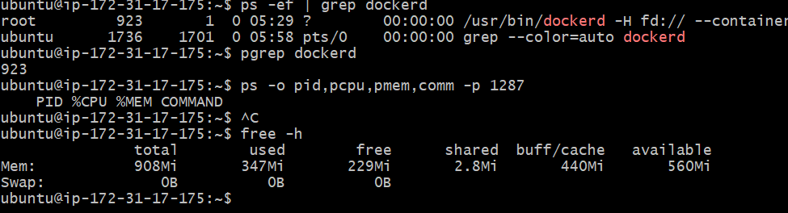 

 **docker stats**

 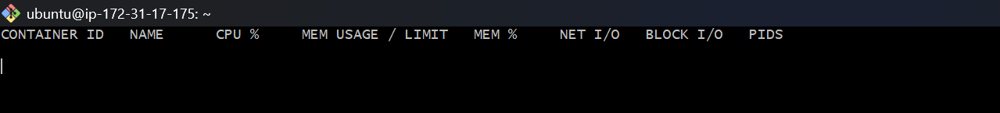 

 - No containers currently running - output shows empty table with only headers. Docker daemon is healthy but idle. This is expected on a local learning environment with no active deployments.

 ## 4. Snapshot: Disk & IO##

 **du -h**

What it does:
- Displays the amount of disk space used by files and directories.
Shows the information once and exits.

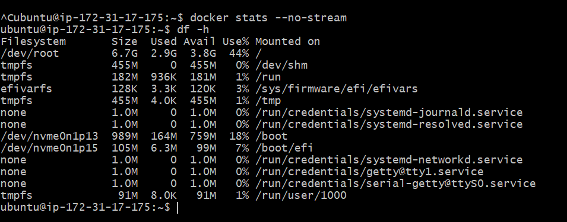 

**docker system df**

is used to display how much disk space Docker is using on your system.

**vmstat 1 3**

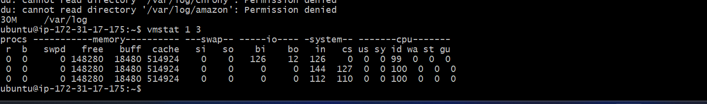 

vmstat = Virtual Memory Statistics
1 = Refresh the statistics every 1 second
3 = Display the statistics 3 times, then exit

So, this command collects and displays system statistics at 1-second intervals, for a total of 3 reports.

## 5. Snapshot: Network##

## Listening ports ##

**ss -tulpn**
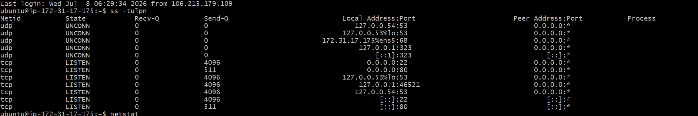

- Lists all TCP and UDP services that are currently listening for network connections and shows which process (including its PID) owns each port

**curl -I localhost**

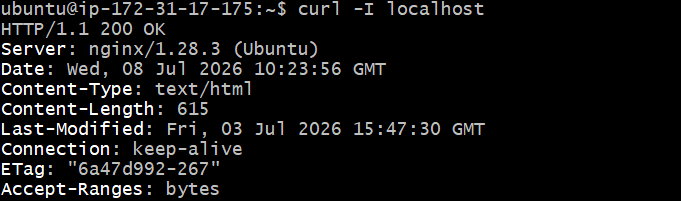

Observation: Nginx is serving requests successfully.

## Logs Reviewed ##

**journalctl -u docker -n 50**

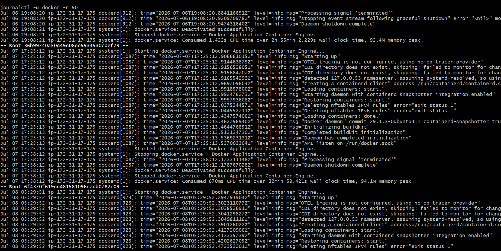

✅ Docker starts successfully.

✅ Docker stops gracefully.

✅ No fatal errors are present.

✅ The nftables messages are informational in this context and are not preventing Docker from running.

## Quick review##
- service running normally with low CPU usage

- Disk and logs size is healthy

- Network port  open and serving connections.

- No errors in logs.

## If this worsens##
- Check logs again

- Check CPU usage/Disk usage

- Restart service

- Check if port is used by other service

.

