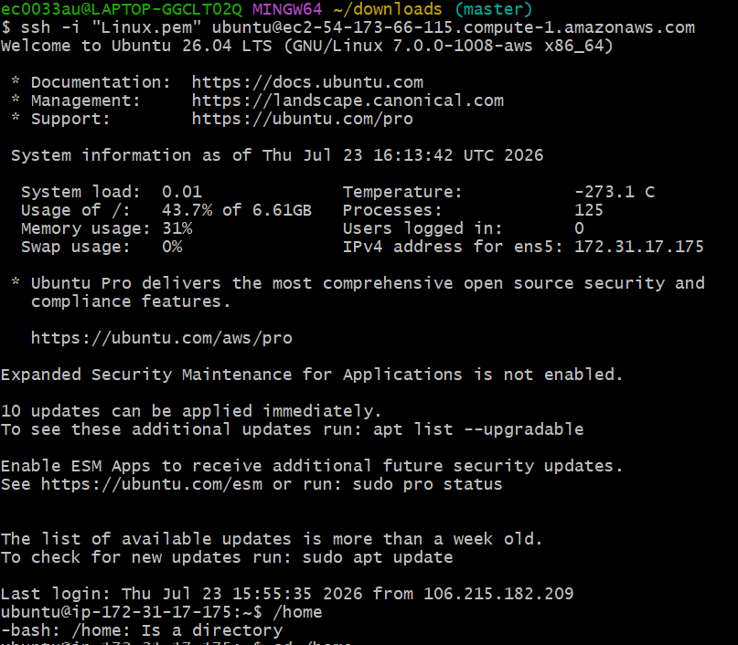
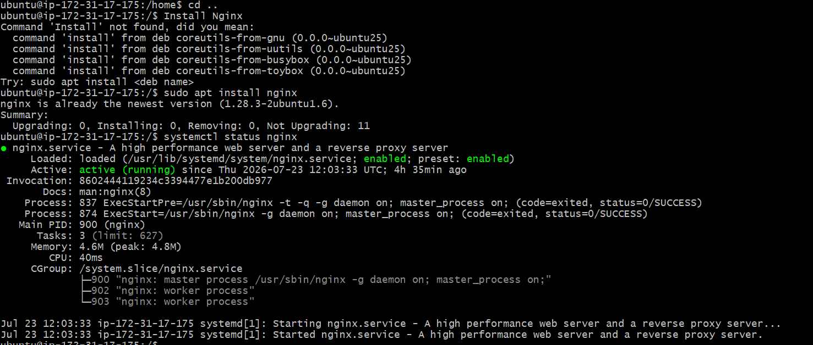
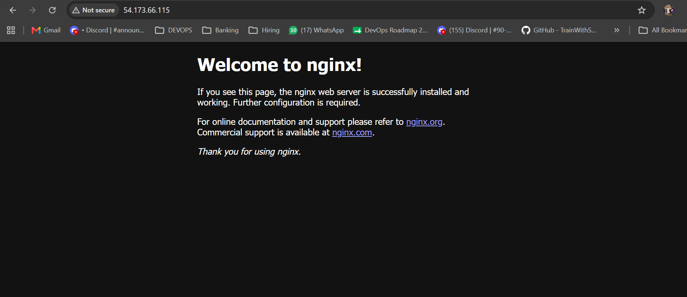
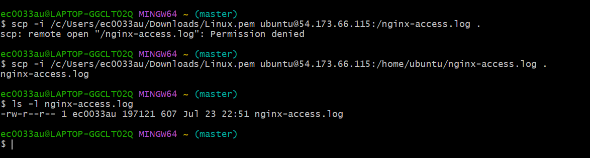

# 🚀 Day 08 – Deploying Nginx on AWS EC2

## 📖 Overview

In this hands-on exercise, I deployed an **Nginx web server** on an **Ubuntu AWS EC2 instance**, configured secure SSH access using a key pair, updated AWS Security Group rules to allow HTTP traffic, verified the deployment through a web browser, and analyzed Nginx access logs. Finally, I securely transferred the log file from the EC2 instance to my local machine using `scp`.

---

## 🎯 Objective

- Launch an Ubuntu EC2 instance on AWS.
- Connect securely using SSH.
- Install and configure the Nginx web server.
- Configure AWS Security Group rules.
- Verify the Nginx deployment in a web browser.
- View and analyze Nginx access logs.
- Transfer log files securely from the EC2 instance to the local machine.

---

# 🏗️ Architecture

```text
                Internet
                    │
                    │ HTTP (80)
                    ▼
        +-------------------------+
        |      AWS EC2 Instance   |
        |      Ubuntu Linux       |
        |                         |
        |         Nginx           |
        +-------------------------+
                    ▲
                    │
              SSH (22)
                    │
            Local Windows Laptop
```

---

# 🛠️ Environment

| Component | Details |
|-----------|---------|
| Cloud Provider | AWS EC2 |
| Operating System | Ubuntu Linux |
| Web Server | Nginx |
| Authentication | SSH Key Pair (.pem) |
| SSH Client | Git Bash |
| Public IP | **54.173.66.115** |

---

# 📌 Step 1 – Launch AWS EC2 Instance

Created an Ubuntu EC2 instance and configured secure remote access.

### Tasks Performed

- Launched Ubuntu EC2 instance
- Created a Key Pair
- Configured Security Group
- Allowed SSH (22)

### Connect to EC2

```bash
ssh -i Linux.pem ubuntu@54.173.66.115
```




# 📌 Step 2 – Update Ubuntu Packages

Updated the package repository and upgraded installed packages.

```bash
sudo apt update
sudo apt upgrade -y
```

---

# 📌 Step 3 – Install Nginx

Install Nginx using the APT package manager.

```bash
sudo apt install nginx 
```

Start the Nginx service.

```bash
sudo systemctl start nginx
```

Enable Nginx to start automatically after reboot.

```bash
sudo systemctl enable nginx
```

Verify the service status.

```bash
sudo systemctl status nginx
```

Expected Output

```text
Active: active (running)
```

📷 **Screenshot**




# 📌 Step 4 – Configure AWS Security Group

Added an inbound rule to allow HTTP traffic.

| Type | Protocol | Port | Source |
|------|----------|------|--------|
| SSH | TCP | 22 | My IP |
| HTTP | TCP | 80 | Anywhere (0.0.0.0/0) |


# 📌 Step 5 – Verify Nginx Deployment

Open the browser and access:

```text
http://54.173.66.115
```

The default **Welcome to Nginx** page confirms that the web server is running successfully.

📷 **Screenshot**




---

# 📌 Step 6 – View Nginx Access Logs

Display the access log.

```bash
sudo cat /var/log/nginx/access.log
```

Sample Output

```text
106.215.xxx.xxx - - [23/Jul/2026:16:56:23 +0000] "GET / HTTP/1.1" 200
106.215.xxx.xxx - - [23/Jul/2026:16:56:24 +0000] "GET /favicon.ico HTTP/1.1" 404
```

# 📌 Step 7 – Copy the Log File

Copy the access log to the home directory.

```bash
sudo cp /var/log/nginx/access.log nginx-access.log
```

Update ownership so the file can be downloaded.

```bash
sudo chown ubuntu:ubuntu /home/ubuntu/nginx-access.log


```

Verify the file.

```bash
ls -l /home/ubuntu/nginx-access.log
```

---

# 📌 Step 8 – Download the Log File

From the local machine, download the file using SCP.

```bash
$ scp -i /c/Users/ec0033au/Downloads/Linux.pem ubuntu@54.173.66.115:/home/ubuntu/nginx-access.log .

```

Verify the downloaded file.

```bash
cat nginx-access.log
```

📷 **Screenshot**




# 💻 Commands Used

| Command | Description |
|----------|-------------|
| `ssh` | Connect to the EC2 instance |
| `apt update` | Update package list |
| `apt upgrade` | Upgrade installed packages |
| `apt install nginx` | Install Nginx |
| `systemctl start nginx` | Start the Nginx service |
| `systemctl enable nginx` | Enable Nginx on boot |
| `systemctl status nginx` | Check service status |
| `cat` | Display file contents |
| `cp` | Copy a file |
| `chown` | Change file ownership |
| `ls -l` | Display file permissions |
| `scp` | Securely transfer files |

---

# 📚 Key Learnings

- Launched an Ubuntu EC2 instance on AWS.
- Connected securely using SSH and a key pair.
- Installed and managed the Nginx web server.
- Configured AWS Security Group rules for SSH and HTTP.
- Verified the Nginx deployment using the EC2 public IP.
- Explored Nginx access logs to understand incoming HTTP requests.
- Learned the meaning of HTTP status codes like **200 OK** and **404 Not Found**.
- Copied log files, managed Linux file permissions, and securely transferred files to the local machine using SCP.

---

# 🎯 Outcome

Successfully deployed an **Nginx web server** on an **AWS EC2 Ubuntu instance**, configured secure remote access, enabled web traffic using Security Groups, verified the deployment through a browser, analyzed access logs, and securely downloaded log files to the local machine. This exercise strengthened my understanding of Linux administration, AWS networking, web server management, and troubleshooting—key skills for a DevOps Engineer.