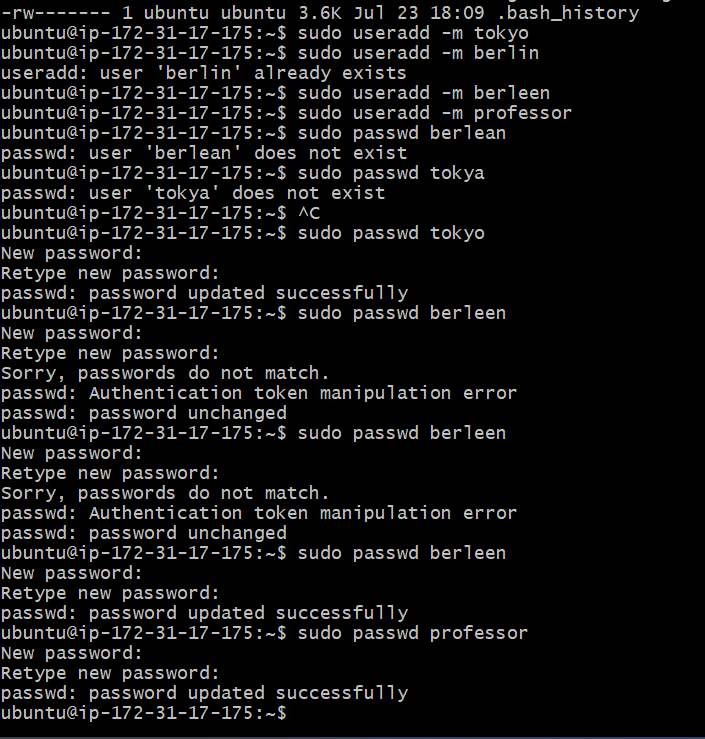
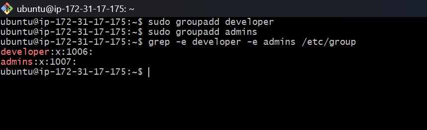
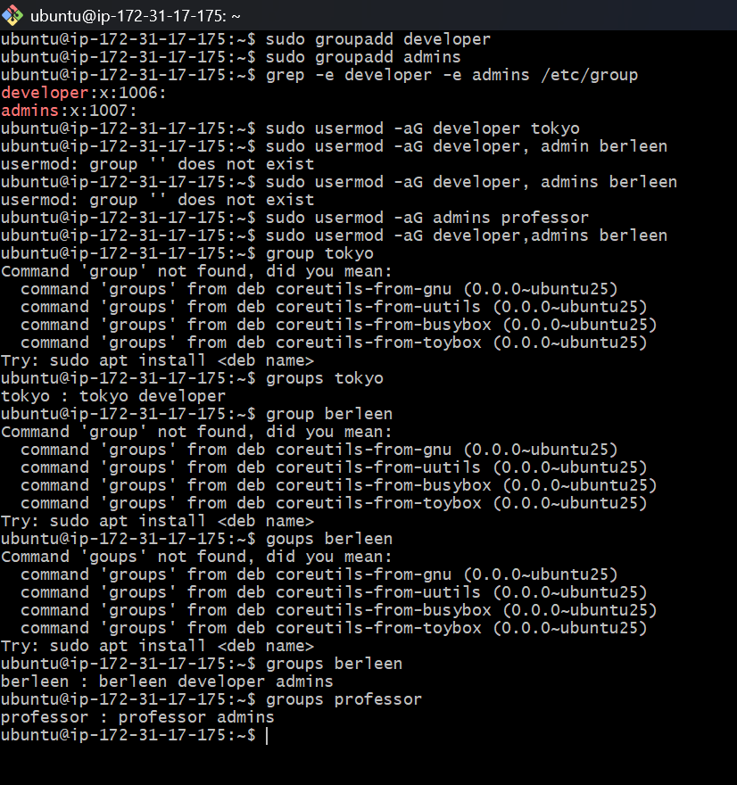
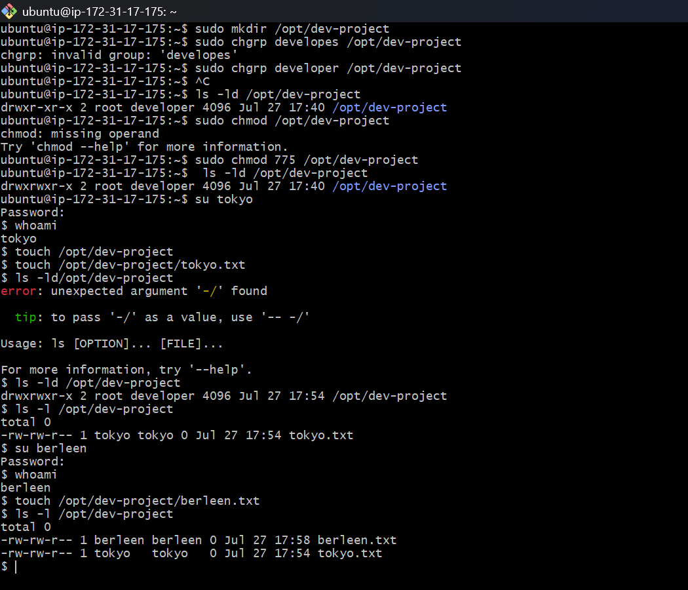
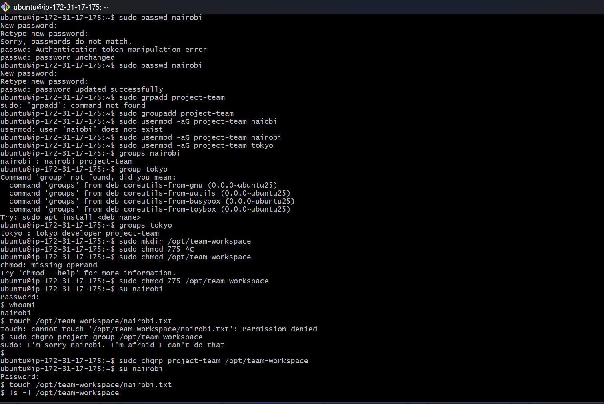

# Day 09 – Linux User & Group Management

## Environment

- Ubuntu (AWS EC2)
- SSH Access

---

# Task 1 – Create Users

Create three users with home directories and passwords:

* tokyo
* berleen
* professor
Verify: Check /etc/passwd and /home/ directory

## Commands

```bash
sudo useradd -m tokyo
sudo useradd -m berleen
sudo useradd -m professor


sudo passwd tokyo
sudo passwd berlin
sudo passwd professor

```

## Output

**User Verification**




---

# Task 2 – Create Groups

Create two groups:

developers
admins
Verify: Check /etc/group

## Commands

```bash
sudo groupadd developers
sudo groupadd admins

```

## Verification

```bash
grep -e developers -e admins  /etc/group
```

## Output

**Group Verification**



---

# Task 3 – Assign Users to Groups
Task 3: Assign to Groups

Assign users:

* tokyo → developer
* berleen → developer + admins (both groups)
* professor → admins
Verify: Use appropriate command to check group membership

## Commands

```bash
sudo usermod -aG developer tokyo
sudo usermod -aG developer,admins berleen
sudo usermod -aG admins professor

```

## Verification

```bash
groups tokyo
groups berleen
groups professor

```

## Output

**Group Membership**



---

# Task 4 – Shared Development Directory

Create directory: /opt/dev-project

Set group owner to developers

Set permissions to 775 (rwxrwxr-x)

Test by creating files as tokyo and berlin

Verify: Check permissions and test file creation


## Commands

```bash
sudo mkdir /opt/dev-project
sudo chgrp developers /opt/dev-project
sudo chmod 775 /opt/dev-project
```

## Verification

```bash
ls -ld /opt/dev-project
```

```bash
su - tokyo
touch /opt/dev-project/tokyo.txt
exit

su - berlin
touch /opt/dev-project/berlin.txt
exit
```

## Output

**Directory Permissions**




---

# Task 5 – Team Workspace

- Create user nairobi with home directory
- Create group project-team
- Add nairobi and tokyo to project-team
- Create /opt/team-workspace directory
- Set group to project-team, permissions to 775
- Test by creating file as nairobi

## Commands

```bash
sudo mkdir /opt/team-workspace
sudo chgrp project-team /opt/team-workspace
sudo chmod 775 /opt/team-workspace
```

## Verification

```bash
ls -ld /opt/team-workspace
```

```bash
su - nairobi
touch /opt/team-workspace/nairobi.txt
exit
```

## Output

**Workspace Permissions**



---

# What I Learned

- Created Linux users with home directories.
- Managed groups and assigned users to multiple groups.
- Configured shared directories using group ownership.
- Applied Linux permission mode **775** for collaboration.
- Verified users, groups, and permissions using Linux commands.
- Tested real-world access by creating files as different users.