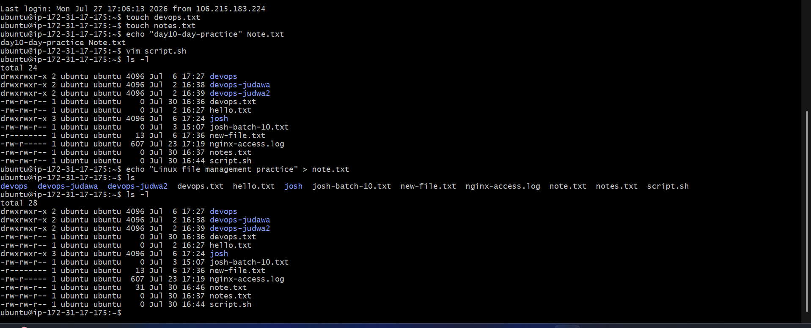
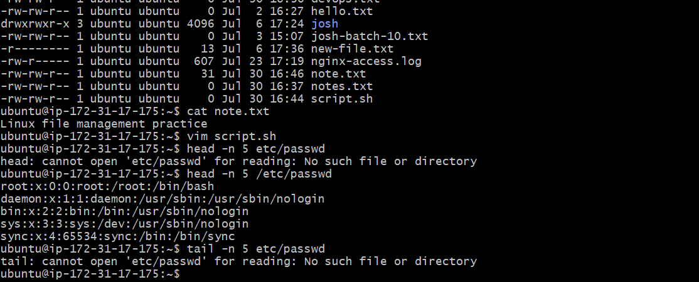
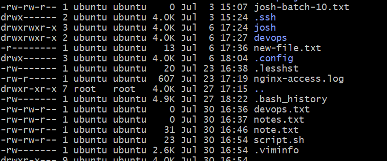
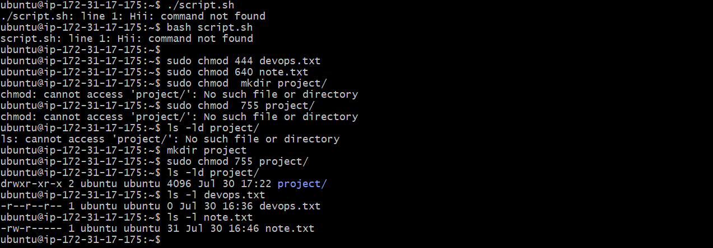
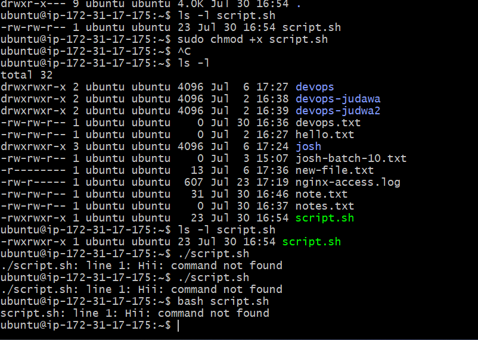
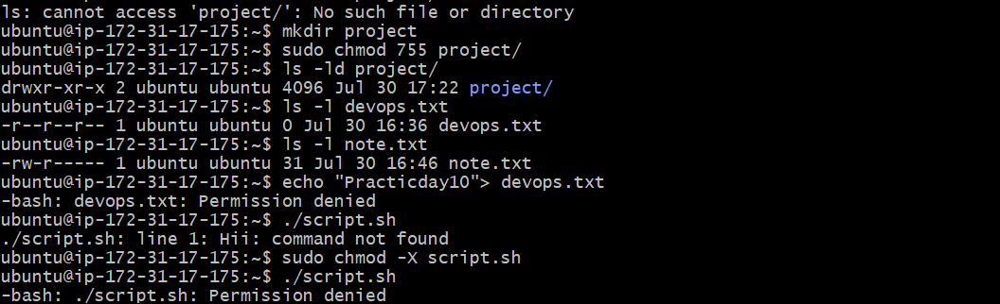

# Day 10 – Linux File Management & Permissions

## Overview

Today's challenge focused on essential Linux file operations and permission management. I practiced creating files, reading file contents, understanding Linux permission models, modifying permissions, and verifying access using different permission settings.

---

## Environment

- **OS:** Ubuntu (AWS EC2)
- **Access Method:** SSH

---

# Task 1 – Create Files

Created the following files:

- `devops.txt` (empty file)
- `notes.txt` (using `echo`)
- `script.sh` (using `vim`)

## Commands

```bash
touch devops.txt

echo "Linux File Management Practice" > notes.txt

vim script.sh
```

Contents of `script.sh`

```bash
echo "Hello DevOps"
```

## Output



---

# Task 2 – Read Files

Verified the contents of files using different Linux commands.

## Commands

```bash
cat notes.txt

head -n 5 /etc/passwd

tail -n 5 /etc/passwd

vim -R notes.txt
```

## Output

### Read File




# Task 3 – Understand File Permissions

Checked the default permissions assigned to newly created files.

## Command

```bash
ls -l
```

### Default Permissions

```text
-rw-r--r--
```

### Permission Breakdown

| Section | Permission | Meaning |
|---------|------------|---------|
| `-` | Regular File | Indicates it is a file |
| Owner | `rw-` | Read & Write |
| Group | `r--` | Read Only |
| Others | `r--` | Read Only |

## Output



---

# Task 4 – Modify Permissions

Modified file permissions using both symbolic and numeric modes.

## Commands

### Make script executable

```bash
chmod +x script.sh
```

### Make file read-only

```bash
chmod 444 devops.txt
```

### Set notes.txt permissions

```bash
chmod 640 notes.txt
```

### Verify

```bash
ls -l
```

## Output




---

# Task 5 – Test Permissions

Verified the updated permissions by executing scripts and testing file access.

## Commands


## Expected Result


## Output



---

# Commands Used

## File Creation

```bash
touch
echo
vim
```

## Reading Files

```bash
cat
head -n
tail -n
vim -R
```

## Permission Management

```bash
chmod +x
chmod 444
chmod 640
ls -l
```

---

# What I Learned

### File Creation and Inspection

- Created files using `touch`, `echo`, and `vim`.
- Viewed file contents using `cat`.
- Used `head` and `tail` to inspect specific sections of system files.
- Opened files in read-only mode using `vim -R`.

### Understanding Linux Permissions

- Learned how Linux represents file permissions using `r`, `w`, and `x`.
- Understood the difference between symbolic permissions (`chmod +x`) and numeric permissions (`chmod 444`, `chmod 640`).
- Learned how ownership, group permissions, and others determine access to a file.

### Testing Permission Changes

- Executed a shell script after adding execute permission.
- Verified that a read-only file prevents write operations.
- Used `ls -l` to confirm permission changes after each modification.

---


