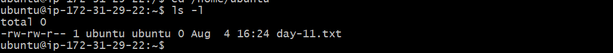
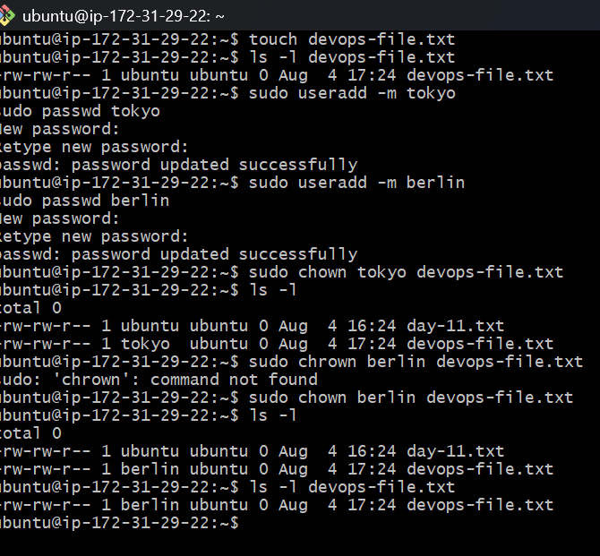
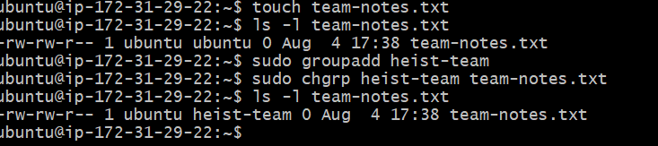
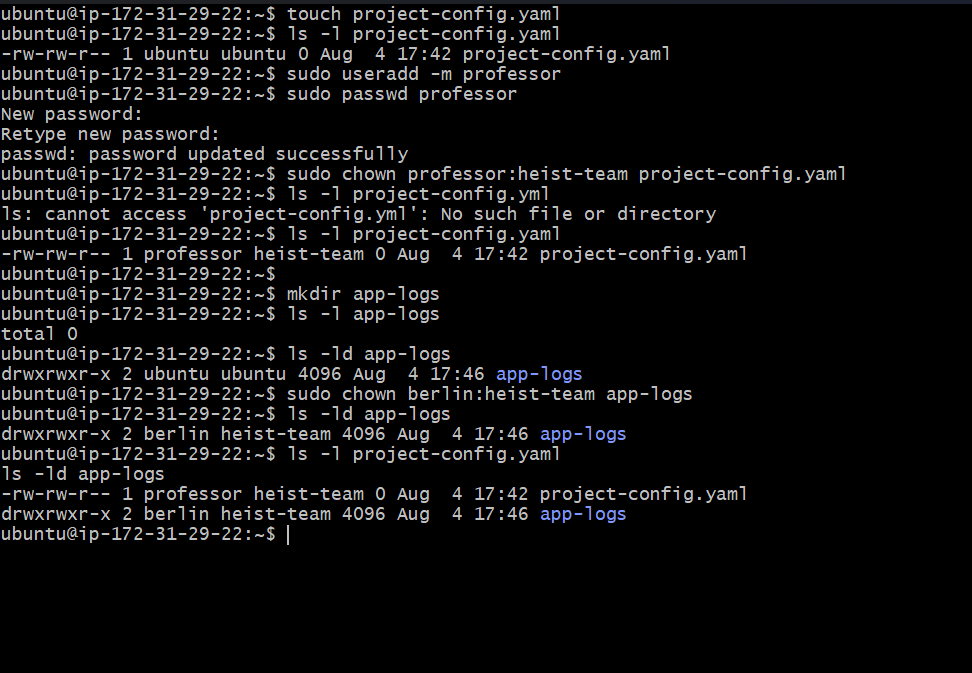
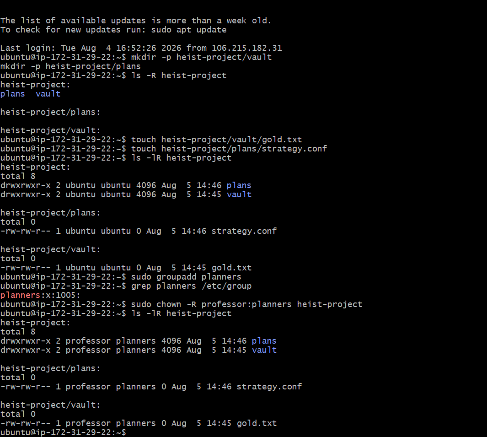
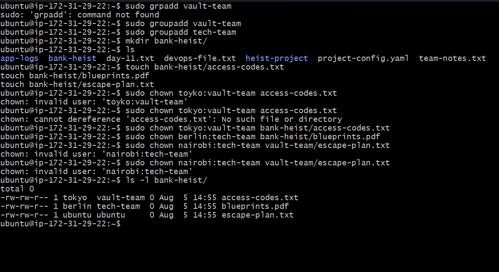

# Task 1 – Understanding Ownership

The objective of this task was to understand how Linux displays file ownership and group information using the `ls -l` command.

## Command

```bash
ls -l
```

## Output




---

## Understanding the Output

Example:

```text
-rw-rw-r-- 1 ubuntu ubuntu 0 Aug 4 16:24 day-11.txt
```

| Part | Value | Meaning |
|------|-------|---------|
| Permissions | `-rw-rw-r--` | Defines who can read, write, or execute the file. |
| Links | `1` | Number of hard links associated with the file. |
| Owner | `ubuntu` | The user who owns the file. |
| Group | `ubuntu` | The group assigned to the file. |
| Size | `0` | File size in bytes. |
| Date | `Aug 4 16:24` | Last modified date and time. |
| Filename | `day-11.txt` | Name of the file. |

---

## Who Owns the File?

**Owner:** `ubuntu`

**Group:** `ubuntu`

### This Means

- The file is owned by the **ubuntu** user.
- The file belongs to the **ubuntu** group.
- By default, Linux assigns the file to the user who creates it and to that user's primary group.

---

## Difference Between Owner and Group

**Owner**
- The user who creates or owns the file.
- The owner can manage the file and change its permissions.

**Group**
- A collection of users who can share access to the file.
- Users who belong to the same group receive the permissions assigned to the group.

---
 ### Permission Breakdown

```text
rw-   rw-   r--
│     │     │
│     │     └── Others
│     └──────── Group
└────────────── Owner
```

| Section | Permission | Meaning |
|---------|------------|---------|
| **Owner** | `rw-` | The owner can **Read** and **Write** the file. |
| **Group** | `rw-` | Members of the group can **Read** and **Write** the file. |
| **Others** | `r--` | All other users can **Read** the file only. |


## Task 2 – Basic `chown` Operations

The objective of this task was to learn how to change the ownership of a file using the `chown` command and verify the changes.

## Commands Used

### Create the file

```bash
touch devops-file.txt
```

### Check the current owner

```bash
ls -l devops-file.txt
```

### Change the owner to `tokyo`

```bash
sudo chown tokyo devops-file.txt
```

### Change the owner to `berlin`

```bash
sudo chown berlin devops-file.txt
```

### Verify the ownership

```bash
ls -l devops-file.txt
```

---

## Screenshot

> **The screenshot below shows the complete process of creating the file, checking the current owner, changing ownership to `tokyo`, then to `berlin`, and verifying the final owner.**



---

## Ownership Changes

| Operation | Owner | Group |
|-----------|-------|-------|
| File Created | ubuntu | ubuntu |
| After `chown tokyo` | tokyo | ubuntu |
| After `chown berlin` | berlin | ubuntu |

---

## Understanding `chown`

The `chown` command stands for **Change Owner**. It is used to transfer ownership of a file or directory from one user to another.

**Syntax**

```bash
sudo chown <new_owner> <file_name>
```

**Example**

```bash
sudo chown berlin devops-file.txt
```

This changes the owner of `devops-file.txt` to **berlin** while keeping the group unchanged.

---

## Key Takeaway

This task demonstrated how file ownership can be transferred between users. After each ownership change, I verified the result using `ls -l` to ensure the correct user was assigned as the file owner.

## Task 3 – Basic `chgrp` Operations

The objective of this task was to understand how to change the group ownership of a file using the `chgrp` command.

## Commands Used

### Create the file

```bash
touch team-notes.txt
```

### Check the current group

```bash
ls -l team-notes.txt
```

### Create a new group

```bash
sudo groupadd heist-team
```

### Change the file group

```bash
sudo chgrp heist-team team-notes.txt
```

### Verify the change

```bash
ls -l team-notes.txt
```

---

## Screenshot

> **The screenshot below shows the complete process of creating the file, checking its current group, creating the `heist-team` group, changing the file's group ownership, and verifying the updated group.**



---

## Group Ownership Changes

| Operation | Owner | Group |
|-----------|-------|-------|
| File Created | ubuntu | ubuntu |
| After `chgrp heist-team` | ubuntu | heist-team |

---

## Understanding `chgrp`

The `chgrp` command stands for **Change Group**. It is used to change the group ownership of a file or directory without changing its owner.

### Syntax

```bash
sudo chgrp <group_name> <file_name>
```

### Example

```bash
sudo chgrp heist-team team-notes.txt
```

After executing the command:

- **Owner** remains **ubuntu**.
- **Group** changes from **ubuntu** to **heist-team**.

---
## Task 4 – Combined Owner & Group Change

The objective of this task was to learn how to change both the **owner** and **group** of a file or directory using a single `chown` command.

## Commands Used

### Create the file

```bash
touch project-config.yaml
```

### Change the owner and group

```bash
sudo chown professor:heist-team project-config.yaml
```

### Verify the changes

```bash
ls -l project-config.yaml
```

---

### Create the directory

```bash
mkdir app-logs
```

### Change the owner and group

```bash
sudo chown berlin:heist-team app-logs
```

### Verify the changes

```bash
ls -ld app-logs
```

---

## Screenshot

> **The screenshot below shows the complete process of creating the file and directory, changing both the owner and group using a single `chown` command, and verifying the changes.**



---

## Ownership Changes

| Item | Before | After |
|------|--------|-------|
| **project-config.yaml** | Owner: `ubuntu`<br>Group: `ubuntu` | Owner: `professor`<br>Group: `heist-team` |
| **app-logs/** | Owner: `ubuntu`<br>Group: `ubuntu` | Owner: `berlin`<br>Group: `heist-team` |

---

## Understanding `chown owner:group`

The `chown` command is used to change the **owner**, **group**, or **both** of a file or directory.

### Syntax

```bash
sudo chown owner:group <file_or_directory>
```

### Example

```bash
sudo chown professor:heist-team project-config.yaml
```

This command changes:

- **Owner** → `professor`
- **Group** → `heist-team`

Similarly,

```bash
sudo chown berlin:heist-team app-logs
```

changes the owner of the directory to **berlin** and its group to **heist-team**.

---

## Key Takeaway

This task demonstrated how a single `chown` command can update both the owner and group of a file or directory. Using the `owner:group` format is more efficient than running separate `chown` and `chgrp` commands, making it a common practice in Linux system administration and DevOps workflows.

# Task 5 – Recursive Ownership

The objective of this task was to learn how to recursively change the owner and group of a directory, including all its subdirectories and files, using the `chown -R` command.

## Commands Used

### Create the directory structure

```bash
mkdir -p heist-project/vault
mkdir -p heist-project/plans
```

### Create the files

```bash
touch heist-project/vault/gold.txt
touch heist-project/plans/strategy.conf
```

### Create the group

```bash
sudo groupadd planners
```

### Change the owner and group recursively

```bash
sudo chown -R professor:planners heist-project
```

### Verify the changes

```bash
ls -lR heist-project
```

---

## Screenshot

> **The screenshot below shows the complete process of creating the directory structure, adding files, creating the `planners` group, changing ownership recursively, and verifying the updated owner and group.**



---

## Ownership Summary

| Item | Owner | Group |
|------|-------|-------|
| `heist-project/` | professor | planners |
| `vault/` | professor | planners |
| `plans/` | professor | planners |
| `gold.txt` | professor | planners |
| `strategy.conf` | professor | planners |

---

## Understanding `chown -R`

The `chown` command is used to change the owner and group of a file or directory.

The `-R` (**Recursive**) option applies the ownership change to:

- The main directory
- All subdirectories
- All files inside the directory

### Syntax

```bash
sudo chown -R <owner>:<group> <directory>
```

### Example

```bash
sudo chown -R professor:planners heist-project
```

This command changes:

- **Owner** → `professor`
- **Group** → `planners`

for the entire `heist-project` directory, including every subdirectory and file.

---

## Key Takeaway

This task demonstrated how to manage ownership for an entire project directory using a single recursive command. Using `chown -R` ensures consistent ownership across all files and subdirectories, making it a common practice in Linux system administration and DevOps when preparing project folders, application directories, and shared workspaces.
# Task 6 – Practice Challenge

The objective of this task was to practice creating users, groups, directories, and files while assigning different owners and groups using the `chown` command.

## Commands Used

### Create Users

```bash
sudo useradd -m tokyo
sudo useradd -m berlin
sudo useradd -m nairobi
```

> **Note:** Skip this step if the users already exist.

---

### Create Groups

```bash
sudo groupadd vault-team
sudo groupadd tech-team
```

---

### Create the Directory

```bash
mkdir bank-heist
```

---

### Create Files

```bash
touch bank-heist/access-codes.txt
touch bank-heist/blueprints.pdf
touch bank-heist/escape-plan.txt
```

---

### Assign Ownership

#### access-codes.txt

```bash
sudo chown tokyo:vault-team bank-heist/access-codes.txt
```

#### blueprints.pdf

```bash
sudo chown berlin:tech-team bank-heist/blueprints.pdf
```

#### escape-plan.txt

```bash
sudo chown nairobi:vault-team bank-heist/escape-plan.txt
```

---

### Verify the Changes

```bash
ls -l bank-heist/
```

---

## Screenshot

> **The screenshot below shows the complete process of creating the directory, creating files, assigning different owners and groups, and verifying the final ownership.**



---

## Ownership Summary

| File | Owner | Group |
|------|-------|-------|
| `access-codes.txt` | tokyo | vault-team |
| `blueprints.pdf` | berlin | tech-team |
| `escape-plan.txt` | nairobi | vault-team |

---

## Understanding `chown`

The `chown` command changes the owner and group of a file or directory.

### Syntax

```bash
sudo chown <owner>:<group> <file>
```

### Examples

```bash
sudo chown tokyo:vault-team bank-heist/access-codes.txt

sudo chown berlin:tech-team bank-heist/blueprints.pdf

sudo chown nairobi:vault-team bank-heist/escape-plan.txt
```

Each command assigns the specified **owner** and **group** to the corresponding file.

---
In this lab, I explored Linux file ownership and group management by performing hands-on exercises with `chown` and `chgrp`. I learned how Linux controls access to files and directories through users, groups, and ownership.

## Tasks Completed

- **Task 1:** Understood file ownership and group information using the `ls -l` command.
- **Task 2:** Changed the owner of a file using the `chown` command and verified the ownership changes.
- **Task 3:** Changed the group ownership of a file using the `chgrp` command.
- **Task 4:** Updated both the owner and group of files and directories using a single `chown owner:group` command.
- **Task 5:** Applied recursive ownership changes to an entire directory structure using the `-R` option.
- **Task 6:** Completed a real-world practice challenge by creating users, groups, project directories, and assigning different ownership to multiple files.

---

# Commands Practiced

- `ls -l`
- `ls -ld`
- `ls -lR`
- `touch`
- `mkdir`
- `mkdir -p`
- `chown`
- `chown -R`
- `chgrp`
- `groupadd`
- `useradd`
- `id`
- `grep`

---

# Key Learnings

- Understood the difference between **Owner**, **Group**, and **Others**.
- Learned how Linux determines file access using ownership and permissions.
- Used the `chown` command to change file and directory ownership.
- Used the `chgrp` command to change group ownership.
- Changed both owner and group simultaneously using `chown owner:group`.
- Applied recursive ownership changes using the `-R` option.
- Verified ownership and group assignments using `ls -l`, `ls -ld`, and `ls -lR`.
- Practiced organizing files with different ownership to simulate real-world Linux administration scenarios.

---

# Conclusion

Day 11 provided practical experience in managing file ownership and group assignments in Linux. Understanding how ownership and groups work is essential for securing files, managing shared resources, and administering Linux systems. These concepts are widely used in DevOps while configuring application directories, shared project folders, deployment environments, and server access.

