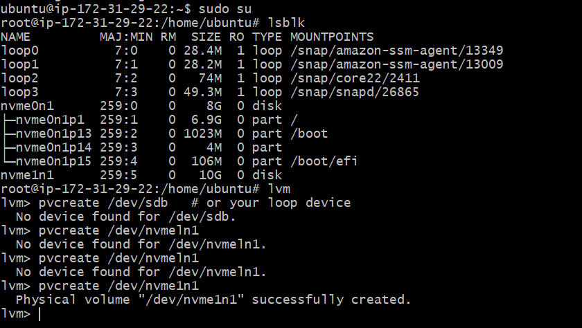
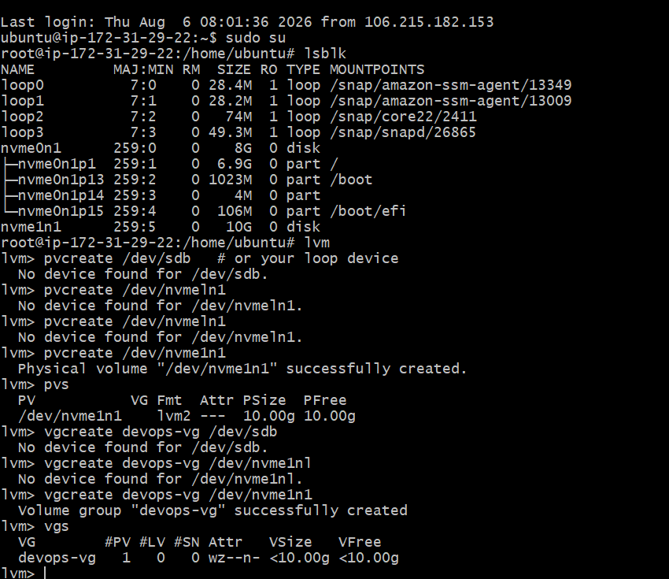
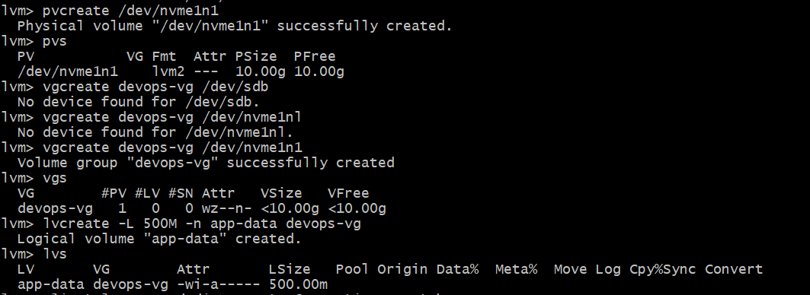
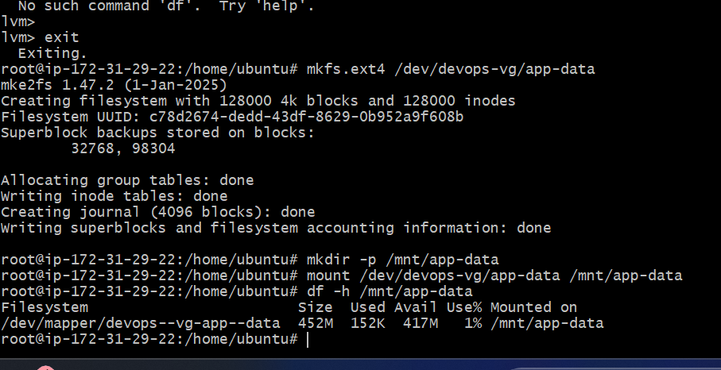
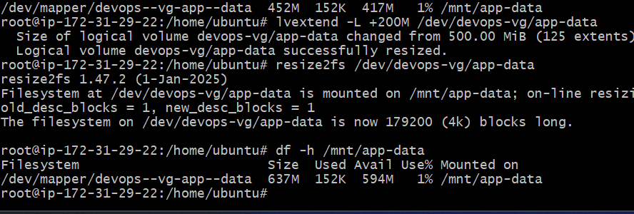

# Day 13 - Linux Volume Management (LVM)

## Objective

Learn how to use Linux Logical Volume Manager (LVM) to create, manage, mount, and extend storage dynamically.

---
# Task 1: Check Current Storage

## Commands

```bash
lsblk
pvs
vgs
lvs
df -h
```

## Description

Checked available disks, mounted filesystems, and existing LVM configuration before creating new volumes.

## Screenshot



---

# Task 2: Create Physical Volume (PV)

## Commands

```bash
pvcreate /dev/sdb
```

```bash
pvs
```

## Description

Initialized the disk as a Physical Volume and verified its creation.

## Screenshot


---

# Task 3: Create Volume Group (VG)

## Commands

```bash
vgcreate devops-vg /dev/sdb
```

```bash
vgs
```

## Description

Created a Volume Group named **devops-vg** and verified it.

## Screenshot



---

# Task 4: Create Logical Volume (LV)

## Commands

```bash
lvcreate -L 500M -n app-data devops-vg
```

```bash
lvs
```

## Description

Created a 500 MB Logical Volume named **app-data**.

## Screenshot



---

# Task 5: Format and Mount the Logical Volume

## Commands

```bash
mkfs.ext4 /dev/devops-vg/app-data

mkdir -p /mnt/app-data

mount /dev/devops-vg/app-data /mnt/app-data

df -h /mnt/app-data
```

## Description

Formatted the logical volume using the ext4 filesystem, mounted it to **/mnt/app-data**, and verified the mount.

## Screenshot



---

# Task 6: Extend the Logical Volume

## Commands

```bash
lvextend -L +200M /dev/devops-vg/app-data

resize2fs /dev/devops-vg/app-data

df -h /mnt/app-data
```

## Description

Extended the logical volume by 200 MB, resized the filesystem, and verified the increased storage.

## Screenshot



---

# LVM Architecture

```text
Disk (/dev/sdb)
      │
      ▼
Physical Volume (PV)
      │
      ▼
Volume Group (VG)
      │
      ▼
Logical Volume (LV)
      │
      ▼
Filesystem (ext4)
      │
      ▼
Mount Point (/mnt/app-data)
```

---

# What I Learned

- Learned the complete LVM workflow: **Physical Volume → Volume Group → Logical Volume**.
- Created, formatted, and mounted a Logical Volume.
- Extended a Logical Volume and resized the filesystem without data loss.

---


