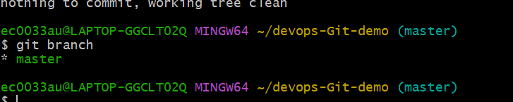
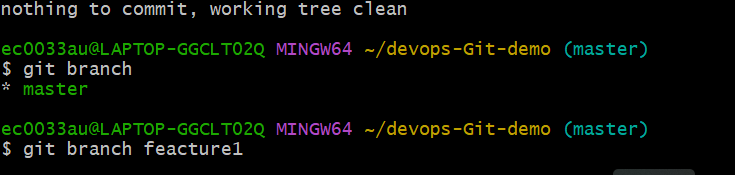
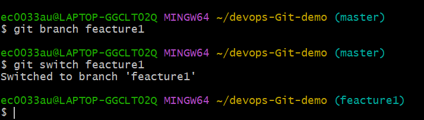
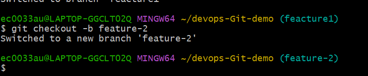
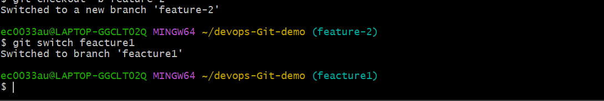
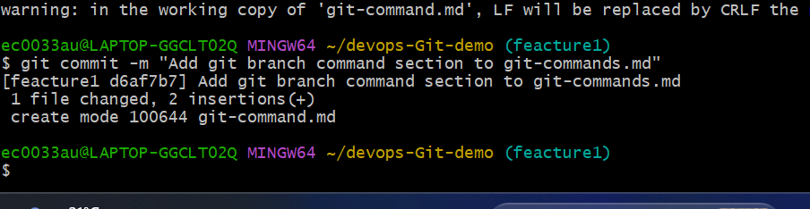
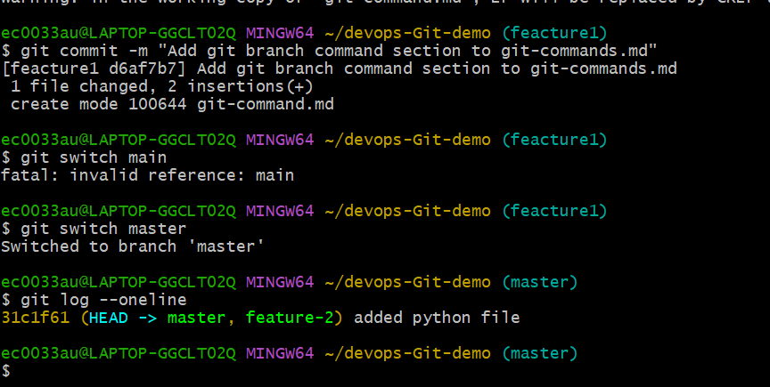
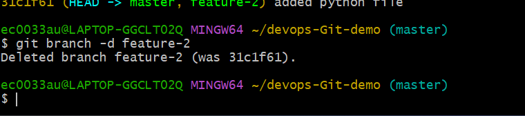

# Day 23 – Git Branching & Working with GitHub

### Task 1: Understanding Branches
1. What is a branch in Git?
- A branch in Git is an independent line of development. It lets you make changes without affecting the main code until you're ready to merge them back.

2. Why do we use branches instead of committing everything to `main`?
- We use branches so that `main` always stays stable and deployable, while work in progress happens somewhere safe.

1. Protecting main
If everyone commits half-finished code straight to main, it breaks for everybody. With branches, unfinished or buggy work stays isolated until it's ready.

2. Parallel work
Several people can build different features or fixes at the same time without stepping on each other's changes. Each person merges when they're done

3. What is `HEAD` in Git?
- `HEAD` is a reference to your current location in the repository.I
- It always points to the latest commit on the branch you are working on.

4. What happens to your files when you switch branches?
- Git updates your project files to look like the branch you switched to.
- Files that exist in the current branch but not in the new branch will disappear temporarily.
- Files that are different in the new branch will be replaced with the new branch version.

---

### Task 2: Branching Commands — Hands-On

1. List all branches in your repo
- `git branch`

     

2. Create a new branch called `feature-1`
- `git branch feature-1`

     

3. Switch to `feature-1`
- `git switch feature-1`
     
     

4. Create a new branch and switch to it in a single command — call it `feature-2`
- `git checkout -b feature-2`

    


5. Try using `git switch` to move between branches — how is it different from `git checkout`?
- `git switch <branch>`   :only switches branches.  
- `git checkout <branch>` :switches branches and can also restore files.

    

6. Make a commit on `feature-1` that does **not** exist on `main`
- `git commit -m "Add git branch command section to git-commands.md"`

    

7. Switch back to `main` — verify that the commit from `feature-1` is not there

     

8. Delete a branch you no longer need
- `git branch -d feature-2`

    

9. Add all branching commands to your `git-commands.md`

---

### Task 3: Push to GitHub
Steps performed:

1. Created a new empty repository on GitHub - **no README, no `.gitignore`** (so it's truly empty and won't conflict with local history).
2. Connected the local repo to the GitHub remote:

```bash
git remote add origin https://github.com/Nandan300/devops-git-practice.git
git remote -v     # verify the remote was added correctly
```

3. Pushed `main` to GitHub:

```bash
git push -u origin main
```

4. Pushed `feature-1` to GitHub:

```bash
git push -u origin feature-1
```

5. Verified on GitHub.com that both `main` and `feature-1` branches are visible in the branch dropdown of the repo.

> 💡 The `-u` flag (`--set-upstream`) links your local branch to the remote branch, so afterwards you can just run `git push` / `git pull` without specifying `origin main` every time.

### `origin` vs `upstream` - what's the difference?

- **`origin`** is just the default nickname Git gives to the remote repository you cloned from (or the one you first added). For most personal projects, `origin` = your own repo on GitHub.
- **`upstream`** is a convention (not a Git rule) used when you're working with a **fork**. It refers to the *original* repository you forked from, so you can pull in updates the original maintainers make, separately from your own fork (`origin`).

Example setup when contributing to an open-source project:

```bash
origin    → https://github.com/Nandan29300/project.git   (your fork)
upstream  → https://github.com/<original-owner>/project.git  (original repo)
```

```
Original Repo
github.com/flutter/flutter
        ↑
     upstream

Your Fork
github.com/nandan/flutter
        ↑
      origin
```

---

## Task 4: Pull from GitHub

1. Edited a file directly on GitHub using the web editor and committed the change on `main`.
2. Pulled the change into the local repo:

```bash
git pull origin main
```

3. Verified the file locally now matches what was changed on GitHub.

### `git fetch` vs `git pull` - what's the difference?

- **`git fetch`** downloads new commits/branches from the remote into your local repo's "remote-tracking branches" (e.g., `origin/main`), but it **does not touch your working files or your local branch**. It's a safe, look-before-you-leap operation - you can inspect what changed before merging it in.
- **`git pull`** is essentially `git fetch` **+** `git merge` (or `git rebase`, depending on config) combined into one step. It fetches the changes *and* immediately merges them into your current branch, updating your working files right away.

Rule of thumb: use `git fetch` when you want to review incoming changes first; use `git pull` when you just want to sync up quickly and trust there won't be conflicts.

---

## Task 5: Clone vs Fork

1. Cloned a public repo directly to the local machine:

```bash
git clone https://github.com/<owner>/<public-repo>.git
```

2. Forked the same repo on GitHub (creates a copy under my own GitHub account), then cloned *that* fork:

```bash
git clone https://github.com/<my-username>/<public-repo>.git
```

### What is the difference between clone and fork?

- **Clone** is a **Git** concept: it downloads a full copy of a repository (all commits, branches, history) onto your local machine. It works on *any* repo you have access to and doesn't require GitHub at all - Git itself has no idea what "GitHub" is.
- **Fork** is a **GitHub** (platform) concept, not a Git command. It creates your own **copy of the repository under your own GitHub account**, so you have a remote repo you can push to - useful when you don't have write access to the original.

### When would you clone vs fork?

- **Clone**: when you already have (or don't need) push access to the repo - e.g., cloning your own team's private repo, or just grabbing a copy of an open-source project to read/run locally.
- **Fork**: when you want to contribute to a project you **don't** have write access to. You fork it, make changes in your own copy, and open a Pull Request back to the original repo.

### After forking, how do you keep your fork in sync with the original repo?

```bash
# 1. Add the original repo as a remote called "upstream" (one-time setup)
git remote add upstream https://github.com/<original-owner>/<repo>.git

# 2. Fetch the latest changes from the original repo
git fetch upstream

# 3. Merge those changes into your local main branch
git switch main
git merge upstream/main

# 4. Push the updated main to your own fork (origin)
git push origin main
```

---

## Key Takeaways

- Branches are cheap, lightweight pointers - use them liberally.
- `HEAD` tracks where you currently are in the repo.
- `git switch` is the modern, safer way to change branches; `git checkout` still works but does too much.
- `origin` = your remote; `upstream` = the original repo you forked from.
- `git fetch` = download only; `git pull` = download + merge.
- `clone` is a Git-level copy; `fork` is a GitHub-level copy under your own account.
